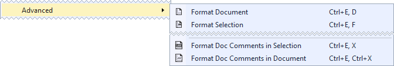

# Format Doc Comments
A Visual Studio extension that formats and word wraps C# XML documentation
comments.

## Getting Started

Install the extension from the [Visual Studio Marketplace].

The extension adds two new commands to the *Edit* › *Advanced* menu:
* *Format Doc Comments in Selection* formats the XML documentation comments that
  overlap the selection.  If nothing is selected then it formats the comment
  under the caret.
* *Format Doc Comments in Document* formats all the XML documentation comments
  in the document.

## Configuration

The formatting style is currently non-configurable.

The word wrap column can be configured by setting a text editor guideline using
the [Editor Guidelines] extension.  If no guidelines are set then it defaults to
80 columns.

[Visual Studio Marketplace]: https://marketplace.visualstudio.com/items?itemName=carlreinke.FormatDocXml
[Editor Guidelines]: https://marketplace.visualstudio.com/items?itemName=PaulHarrington.EditorGuidelines
