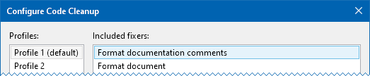

# Format Doc Comments
A Visual Studio extension that formats and word wraps C# documentation comments.

## Getting Started

Install the extension from the [Visual Studio Marketplace].

The extension adds two new commands to the *Edit* › *Advanced* menu:
 * *Format Doc Comments in Selection* formats the documentation comments that
   overlap the selection.  If nothing is selected then it formats the comment
   under the caret.
 * *Format Doc Comments in Document* formats all the documentation comments in
   the document.

The extension also adds a code cleanup fixer.

## Configuration

The formatting style is currently non-configurable.

The word wrap column can be configured by setting the `max_line_length` or
`guidelines` editorconfig properties or by setting a text editor guideline using
the [Editor Guidelines] extension.  If nothing is set then it defaults to 80
columns.

[Visual Studio Marketplace]: https://marketplace.visualstudio.com/items?itemName=carlreinke.FormatDocComments
[Editor Guidelines]: https://marketplace.visualstudio.com/items?itemName=PaulHarrington.EditorGuidelines
